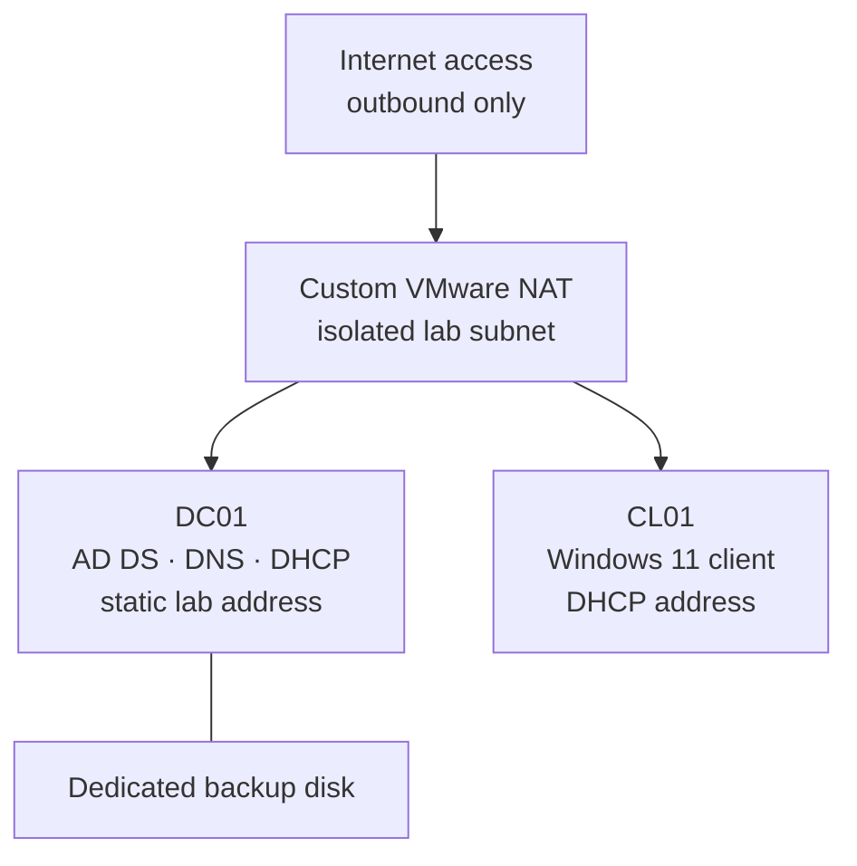

# Case Study 1 — Requirements and Minimum Windows Lab Architecture

**Task:** 1.1
**Version:** 1.2 — public sanitised edition
**Decision date:** 22 July 2026
**Owner:** Portfolio owner
**Status:** Gate 1 design baseline — public identifiers sanitised

## 1. Case-study objective

Build and operate a small Windows domain that produces credible evidence for UK 2nd Line Support, Infrastructure Support, and operational Windows Engineer roles.

The case study must prove that the environment was implemented, validated, deliberately faulted, diagnosed, recovered, and documented. It is not intended to simulate a large enterprise.

## 2. Business scenario

A small organisation needs a controlled Windows environment for central identity, workstation management, IP address allocation, name resolution, operational support, and recovery. The environment must be inexpensive, repeatable, and supportable by one administrator.

## 3. Scope

### Included

- One Windows Server 2025 domain controller with AD DS, DNS, and DHCP
- One Windows 11 Enterprise client
- One forest and one domain
- OU, user, group, computer, and delegated-helpdesk administration
- Joiner, mover, and leaver operations
- Domain join and Group Policy processing
- Windows updating and basic operational health checks
- PowerShell lifecycle automation
- System-state backup, GPO backup, and tested recovery
- Three controlled support incidents
- Change, incident, knowledge, validation, and handover evidence

### Excluded

- Second domain controller, second site, child domain, or trust
- PKI / AD CS, WSUS, DFS, RDS, SCCM, or file-server build
- Azure integration, Entra Connect, Intune, Autopilot, or Microsoft 365
- Internet-facing services, port forwarding, or inbound access
- Hyper-V, VirtualBox, nested virtualisation, or physical-host domain join
- High availability, DHCP failover, or production-scale performance testing
- Any paid licence, subscription, appliance, or marketplace product

An excluded component may not be added during Case Study 1 without a recorded scope change.

## 4. Architecture decision

### 4.1 Topology



The laboratory uses two VMs on a capacity-verified local Windows host. `DC01` combines AD DS, DNS, and DHCP because the case study is a constrained single-server lab. This is not presented as a production high-availability design.

### 4.2 Host and VM allocation

| Component | Platform | vCPU | RAM | Thin-provisioned disk | Function |
|---|---|---:|---:|---:|---|
| Local host | Windows 11 Pro and VMware Workstation | — | Capacity verified privately | Private local storage | Primary lab host |
| `DC01` | Windows Server 2025 Evaluation, Desktop Experience | 2 | 4 GB | Thin-provisioned OS and backup disks | AD DS, DNS, DHCP, backup |
| `CL01` | Windows 11 Enterprise Evaluation | 4 | 6 GB | Thin-provisioned OS disk | Domain client and support target |

Maximum planned VM memory is 10 GB and was validated against the private host baseline. No `MGMT01` VM is authorised for the MVP. The VMs use VMware NAT rather than bridged networking, keeping lab addressing isolated from the physical LAN.

Use official evaluation media only. Windows Server 2025 Evaluation expires after 180 days and must be activated online during its initial grace period. Windows 11 Enterprise Evaluation is a 90-day evaluation. The physical host's Windows key must not be reused in either VM.

### 4.3 Storage boundary

VM and ISO locations are maintained in the private build record. ISO sources and SHA-256 hashes must be recorded before installation. ISO files, VMDKs, memory files, snapshots, raw backups, local paths, and storage-device details must never be committed to GitHub.

The required system-state and GPO backups remain on a dedicated `DC01` backup virtual disk for controlled recovery drills. Any secondary backup target is private, access-controlled, and not required for normal lab operation or any acceptance criterion.

### 4.4 Virtual network

| Setting | Approved value |
|---|---|
| VMware network | Dedicated custom network; private identifier |
| Network type | NAT; outbound internet only |
| IPv4 network | Private RFC1918 lab subnet; exact value withheld |
| VMware host adapter | Static address in reserved lab range |
| NAT gateway | Static address in reserved lab range |
| VMware DHCP | Disabled |
| Windows DHCP server | `DC01` |
| Inbound port forwarding | None |
| Physical LAN bridge | None |

This subnet must not overlap with the physical LAN. During preflight, the host adapter's current subnet and VMware Virtual Network Editor configuration must be verified privately. An unused custom VMnet will be selected without publishing physical or lab addressing.

### 4.5 IP and DNS plan

| Item | Address or value |
|---|---|
| Network | Private RFC1918 `/24` lab subnet |
| Reserved network range | Lower portion of the lab subnet |
| `DC01` | Static address in the reserved range |
| Default gateway | VMware NAT gateway |
| Preferred DNS on `DC01` | `DC01` static address |
| DNS forwarder | Public resolver, recorded during build |
| DHCP scope | Middle portion of the lab subnet |
| Future/reserved range | Upper portion of the lab subnet |
| DHCP option 003 | VMware NAT gateway |
| DHCP option 006 | `DC01` static address |
| DHCP option 015 | `corp.test` |
| Lease duration | 8 days |

`CL01` must receive its address, gateway, DNS server, and DNS suffix from `DC01`. It must not use a public DNS server directly because AD DS clients must query the domain DNS service.

### 4.6 Naming and directory design

| Object | Approved value |
|---|---|
| Forest/domain FQDN | `corp.test` |
| NetBIOS name | `CORP` |
| Domain controller | `DC01` |
| Client | `CL01` |
| Standard user convention | `firstname.lastname` |
| Security group convention | `GG-<Function>` |
| GPO convention | `GPO-<Target>-<Purpose>` |

The `.test` suffix is used only inside the isolated laboratory and prevents accidental dependence on a real public namespace.

Minimum OU structure:

```text
corp.test
└── InfraOps
    ├── Admins
    ├── Groups
    ├── Servers
    ├── Users
    ├── Disabled Users
    └── Workstations
```

Minimum delegated role:

- `GG-Helpdesk` may reset passwords and unlock standard accounts in the `Users` OU.
- Members of `GG-Helpdesk` must not receive Domain Admin membership.

Minimum GPO set:

- `GPO-Domain-Account-Policy`
- `GPO-Workstation-Baseline`

The workstation baseline must contain a small, explicitly documented set of testable settings. It must not claim to be a complete enterprise security baseline.

## 5. Functional requirements

| ID | Requirement |
|---|---|
| FR-01 | Deploy both VMs from official evaluation media and patch them to a recorded baseline. |
| FR-02 | Create the `corp.test` forest and verify AD DS and DNS health. |
| FR-03 | Configure an authorised DHCP scope with the approved router, DNS, and suffix options. |
| FR-04 | Join `CL01` to the domain using domain DNS and move it into the correct OU. |
| FR-05 | Implement the approved OU structure, groups, sample users, and least-privilege helpdesk delegation. |
| FR-06 | Execute one joiner, one mover, and one leaver workflow with before-and-after validation. |
| FR-07 | Apply and verify the two approved GPOs on the correct targets. |
| FR-08 | Automate selected joiner/leaver tasks in PowerShell with validation, error handling, logging, and `-WhatIf` support where changes are made. |
| FR-09 | Complete a system-state backup and a separate GPO backup to the `DC01` backup disk. |
| FR-10 | Complete and verify one directory-object recovery and one GPO recovery. |
| FR-11 | Diagnose and resolve the three approved controlled incidents. |
| FR-12 | Produce the operational records and interview evidence defined in section 8. |

## 6. Non-functional requirements

| ID | Requirement |
|---|---|
| NFR-01 | Direct spend remains £0. |
| NFR-02 | No inbound exposure, bridge to the physical LAN, or production connectivity is permitted. |
| NFR-03 | No secrets, licence keys, personal data, host/home addresses, or unsanitised identifiers enter the portfolio. |
| NFR-04 | The complete lab must run within 10 GB assigned VM memory and the privately approved storage ceiling. |
| NFR-05 | Every claim must be supported by commands, logs, configuration exports, or repeatable tests; screenshots are supporting evidence only. |
| NFR-06 | Scripts must use parameters rather than embedded passwords, and must not contain plaintext credentials. |
| NFR-07 | VMware snapshots are temporary rollback aids, not accepted as AD DS backup or recovery evidence. |
| NFR-08 | The environment must be rebuildable from the approved documentation and scripts. |
| NFR-09 | Loss of any secondary backup target must not interrupt the lab; secondary material requires a tested, access-controlled restore path before reliance. |

## 7. Controlled incidents and recovery drills

| ID | Controlled fault | Expected symptom | Required diagnostic evidence | Recovery condition |
|---|---|---|---|---|
| INC-01 | Set `CL01` to an incorrect DNS server | Domain resources and domain name resolution fail | `ipconfig /all`, `Resolve-DnsName`, `nslookup`, event/log observations | Correct DNS restored; domain resolution and secure channel pass |
| INC-02 | Disable or mis-scope `GPO-Workstation-Baseline` | Expected setting is absent on `CL01` | `gpresult`, GPMC scope/status, relevant event log | Correct link/scope restored; policy appears in resultant set |
| INC-03 | Deactivate the DHCP scope and renew `CL01` | Lease renewal fails or client receives no valid lab lease | `ipconfig`, DHCP console/PowerShell status, DHCP logs/events | Scope reactivated; valid lease and options received |
| REC-01 | Delete a designated test user | User cannot authenticate and object is absent | AD object lookup and deleted-object evidence | Same test object restored and key attributes verified |
| REC-02 | Deliberately alter one approved GPO after backup | Known baseline setting changes | GPO report comparison | GPO restored from backup and client result revalidated |

Faults are introduced only after a known-good baseline and recovery check exist. The administrator account used for recovery must not be the test account being changed.

## 8. Evidence deliverables

Only verified work will be published. Case Study 1 requires:

1. One concise case-study overview and business outcome.
2. One final architecture diagram and IP/naming table.
3. One implementation record containing key decisions and change results.
4. Sanitised configuration exports or command outputs for AD DS, DNS, DHCP, GPO, patching, and backup.
5. PowerShell scripts plus a short usage guide and sample sanitised logs.
6. One validation checklist mapped to the acceptance criteria.
7. Three incident records: impact, priority, diagnosis, resolution, validation, communication, and prevention.
8. One recovery record covering directory-object and GPO recovery.
9. One knowledge article for diagnosing a domain-join or DNS problem.
10. One change record with risk, implementation, validation, rollback, and outcome.
11. One brief operational handover.
12. Two accurate CV bullets and a 90-second interview explanation.

Screenshots will be cropped, sanitised, and used only when they add information that text exports do not communicate clearly.

## 9. Acceptance criteria

Gate 2 cannot be reached until every mandatory criterion passes.

| ID | Pass condition | Minimum validation |
|---|---|---|
| AC-01 | Both VMs run simultaneously within the approved host allocation. | VMware inventory and host/guest resource check |
| AC-02 | `DC01` is the only domain controller for `corp.test`; forest and domain queries succeed. | `Get-ADForest`, `Get-ADDomain`, `dcdiag` |
| AC-03 | AD-integrated forward and reverse DNS resolve the lab server and client correctly. | `Resolve-DnsName` forward/reverse tests and DNS zone export |
| AC-04 | `CL01` receives the approved DHCP lease and options from `DC01`. | `ipconfig /all`, DHCP lease and scope output |
| AC-05 | `CL01` is domain joined, placed in `Workstations`, and has a healthy secure channel. | `Get-ADComputer`, `Test-ComputerSecureChannel` |
| AC-06 | OU, group, user, and delegated-helpdesk tasks work without granting Domain Admin. | AD queries plus successful allowed and denied delegation tests |
| AC-07 | Joiner, mover, and leaver outcomes match the documented lifecycle procedure. | Before/after AD exports and sign-in/access tests |
| AC-08 | Both approved GPOs apply to intended targets and can be traced to their settings. | GPO reports and `gpresult`/resultant-set evidence |
| AC-09 | Server and client update status, build, last reboot, service health, and critical event review are recorded. | PowerShell/Windows Update and event evidence |
| AC-10 | Lifecycle automation succeeds on a test account, handles a deliberate invalid input, and produces a useful log. | Script test transcript and resulting AD state |
| AC-11 | System-state and GPO backups complete successfully and are discoverable. | `wbadmin` version/status output and GPO backup metadata |
| AC-12 | Directory object and GPO are restored and their expected attributes/settings are verified. | Before/fault/after comparison |
| AC-13 | All three incident symptoms are reproduced, diagnosed from evidence, corrected, and regression-tested. | Completed incident records and validation outputs |
| AC-14 | No prohibited data or binary lab artefacts are present in the publication set. | Final content and secret scan |
| AC-15 | The case study can be explained accurately in 90 seconds and supports two defensible CV bullets. | Final narrative review against published evidence |

## 10. Build order

1. Record preflight state: free space, VMware version, existing virtual networks, ISO sources, and hashes.
2. Create and validate the dedicated custom NAT network with VMware DHCP disabled and no port forwarding.
3. Create `DC01`, install VMware Tools, patch it, assign the static IP, and record the baseline.
4. Install AD DS and create `corp.test`; validate AD DS and DNS before continuing.
5. Install and authorise DHCP; create the approved scope and validate lease delivery with a temporary test if needed.
6. Build the OU, group, user, delegation, and GPO baseline.
7. Attach and initialise the backup disk; install Windows Server Backup; complete the initial system-state and GPO backups.
8. Create and patch `CL01`, install VMware Tools, obtain a DHCP lease, and join the domain.
9. Validate domain operations, DNS, DHCP, GPO, delegation, and joiner/mover/leaver workflows.
10. Build and test the approved PowerShell automation.
11. Establish the final known-good baseline and confirm recovery readiness.
12. Run the controlled incidents and recovery drills one at a time, returning to known-good state after each.
13. Assemble, sanitise, and quality-check the evidence package.

No controlled fault may be introduced before step 11.

## 11. Risks and controls

| Risk | Control |
|---|---|
| VMware network change affects another VM | Record current configuration and select an unused custom VMnet before change |
| VMware DHCP conflicts with Windows DHCP | Disable VMware DHCP on the lab VMnet and verify only `DC01` responds |
| Domain client uses external DNS | Deliver only `DC01` through DHCP option 006 and verify with `ipconfig /all` |
| Evaluation period is wasted | Download only at build start and complete Case Study 1 within the planned 14-day window |
| AD recovery is attempted from a snapshot | Use AD-aware system-state backup; snapshots are only short-lived build rollback points |
| Backup is stored with the only VM disk | Use a separate virtual disk and retain sanitised configuration/scripts outside the VM |
| Secondary-storage health or access is assumed rather than verified | Inspect storage health, access controls, and restore capability during private preflight |
| Secondary-storage exposure or credentials increase risk | No port forwarding; use least-privilege access; keep credentials and private share details outside GitHub; prohibit direct guest access unless separately approved |
| Evidence leaks user/home data | Use synthetic identities, lab-only addressing, sanitisation, and a final secret/content scan |
| Scope expands during implementation | Enforce the exclusions and one-task-at-a-time rule from the charter |

## 12. Gate 1 decision

This design satisfies the charter with the smallest credible topology:

- **two VMs;**
- **one domain;**
- **one isolated NAT network;**
- **one domain controller;**
- **£0 direct spend;**
- **no cloud or Microsoft 365 dependency.**

Gate 1 is passed. The current authorised task is:

> **Task 1.3 — Complete the private local build preflight.**

VM construction remains unauthorised until Task 1.3 validates the hypervisor, evaluation media, host connectivity, storage, and backup prerequisites.

## 13. Authoritative references

- [Windows Server 2025 Evaluation — Microsoft Evaluation Center](https://www.microsoft.com/en-us/evalcenter/evaluate-windows-server-2025)
- [Windows 11 Enterprise Evaluation — Microsoft Evaluation Center](https://www.microsoft.com/en-us/evalcenter/evaluate-windows-11-enterprise)
- [Install and configure DNS Server — Microsoft Learn](https://learn.microsoft.com/en-us/windows-server/networking/dns/quickstart-install-configure-dns-server)
- [DNS client settings best practices — Microsoft Learn](https://learn.microsoft.com/en-us/troubleshoot/windows-server/networking/best-practices-for-dns-client-settings)
- [Virtualized domain controller recovery guidance — Microsoft Learn](https://learn.microsoft.com/en-us/windows-server/identity/ad-ds/manage/virtual-dc/virtualized-domain-controller-troubleshooting)
